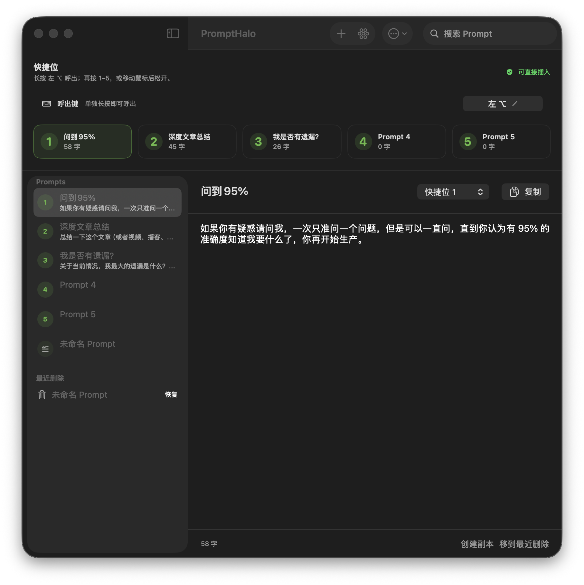
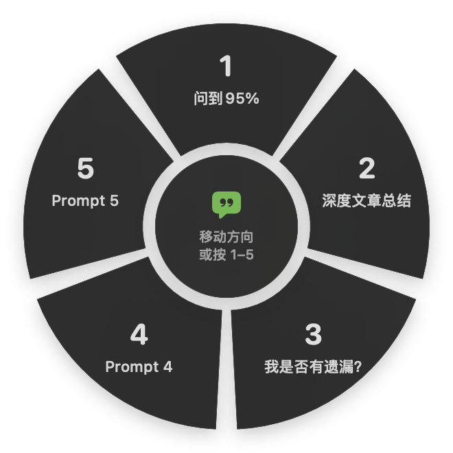

<div align="center">

# PromptHalo

**Five prompts. One gesture. Zero prompt hunting.**

A native macOS prompt wheel for the five instructions you actually use.

[中文](#中文) · [Download Alpha](https://github.com/LLLc1018com-arch/PromptHalo/releases/latest) · [Report a Bug](https://github.com/LLLc1018com-arch/PromptHalo/issues/new?template=bug_report.yml)


</div>

<p align="center">
  
  
</p>

## Why PromptHalo

Prompt libraries are easy to fill and annoying to use. The valuable prompt is usually buried in a note, document, or chat history when you need it.

PromptHalo keeps the library in the background and puts only five prompts in muscle memory:

```text
Hold Left Option
        ↓
Choose 1–5 or move the pointer
        ↓
Release
        ↓
The full prompt is inserted into the active text field
```

No searching. No copy-switch-paste loop. No account.

## What works today

- Native SwiftUI manager and AppKit non-activating radial wheel
- Five fixed quick slots, selected by number or pointer direction
- Long-press Left `Option` by default
- Customizable trigger, including Right `Option` or a normal key combination
- Direct insertion into the active text field
- Clipboard snapshot and restoration after insertion
- Local JSON storage, search, duplicate, trash, import, and export
- Chinese and English UI
- Interface language follows macOS by default and can be changed manually
- Universal binary for Apple silicon and Intel Macs

PromptHalo is an early Build in Public alpha. The core interaction works, but cross-app reliability and distribution are still being hardened.

## Five starter prompts

New installations receive five substantial, general-purpose prompts in the language of the initial interface:

1. **95% Clarity Gate** — clarify the task one question at a time before producing.
2. **Evidence-First Research** — separate facts, inference, dissent, and action.
3. **Plan · Critique · Execute** — define done, challenge the plan, execute, and verify.
4. **Human Voice Editor** — remove generic AI prose without flattening the author.
5. **Learn It for Real** — use diagnosis, Feynman explanation, active recall, and transfer.

Changing the interface language never translates or overwrites existing prompts.

The starter prompts were rewritten for PromptHalo after reviewing recent high-engagement prompt workflows on X. The research notes and source links are in [PROMPT_RESEARCH.md](PROMPT_RESEARCH.md).

## Install the Alpha

1. Download the latest ZIP from [GitHub Releases](https://github.com/LLLc1018com-arch/PromptHalo/releases/latest).
2. Unzip it and move `PromptHalo.app` to `/Applications`.
3. Because the current alpha is not yet Apple-notarized, macOS may require Control-clicking the app and choosing **Open**.
4. In **System Settings → Privacy & Security → Accessibility**, allow PromptHalo.
5. Focus any text field, hold Left `Option` for about 0.22 seconds, choose `1–5`, then release.

The release is intentionally marked **pre-release** until Developer ID signing and notarization are in place.

## Build from source

Requirements:

- macOS 14 or later
- Swift 6.2 Command Line Tools
- No full Xcode installation required

```bash
git clone https://github.com/LLLc1018com-arch/PromptHalo.git
cd PromptHalo

./run_tests.sh
./setup_local_signing.sh
./build_app.sh

open dist/PromptHalo.app
```

`setup_local_signing.sh` creates a local code-signing identity in your login keychain. It is used only to keep macOS permissions stable across local rebuilds.

## Data and privacy

PromptHalo has no account, cloud sync, analytics, or network dependency. Prompts stay on the Mac at:

```text
~/Library/Application Support/PromptHalo/prompts.json
```

Accessibility permission is used to monitor the configured trigger and emit paste events. If permission is unavailable, PromptHalo falls back to copying the prompt.

## Current validation

- Lightweight core checks: `6/6`
- Universal build: `arm64 + x86_64`
- Left `Option` → slot `1` → direct TextEdit insertion: passed
- Existing prompt data preserved when switching UI language: passed

Run the same checks locally with:

```bash
./run_tests.sh
```

## Roadmap

- [ ] Harden first-run Accessibility permission recovery
- [ ] Prevent insertion if the target app changes
- [ ] Expand the cross-app reliability matrix
- [ ] Add prompt-data backup and recovery
- [ ] Developer ID signing and Apple notarization
- [ ] Improve the public demo and onboarding

The stop rule is simple: reliability before cloud sync, accounts, marketplaces, or AI rewriting.

## Contributing

Bug reports, reproduction steps, and small focused pull requests are welcome. Please read [CONTRIBUTING.md](CONTRIBUTING.md) before opening a PR.

The source is public for early feedback, but a reuse license has not yet been selected. Until a license is added, normal copyright restrictions apply.

---

## 中文

PromptHalo 是一个只活在 Mac 菜单栏里的 Prompt 喊话轮盘。

它不想再做一个越存越多的 Prompt 收藏夹。后台可以管理很多 Prompt，但前台永远只有五格：长按左 `Option`，按下 `1–5` 或移动鼠标，松手后完整 Prompt 直接进入当前输入框。

### 当前功能

- 五个固定快捷位，支持数字和方向选择
- 默认长按左 `Option`，也可自定义右 `Option` 或普通组合键
- 自动插入并恢复原剪贴板
- 本地 JSON 存储，不注册、不登录、不联网
- 搜索、新建、副本、最近删除、导入与导出
- 中文、英文界面，首次启动跟随 Mac 系统语言
- Apple 芯片和 Intel Mac 通用版本

### 使用

1. 从 [GitHub Releases](https://github.com/LLLc1018com-arch/PromptHalo/releases/latest) 下载 Alpha ZIP。
2. 解压后把 `PromptHalo.app` 放进“应用程序”。
3. 当前版本尚未完成 Apple 公证，第一次打开可能需要右键应用并选择“打开”。
4. 在“系统设置 → 隐私与安全性 → 辅助功能”中允许 PromptHalo。
5. 在任意输入框长按左 `Option`，选择 `1–5`，松开后自动插入。

这是一个 Build in Public 的 Alpha。先把真正高频的 Prompt 变成肌肉记忆，再考虑更大的功能。
