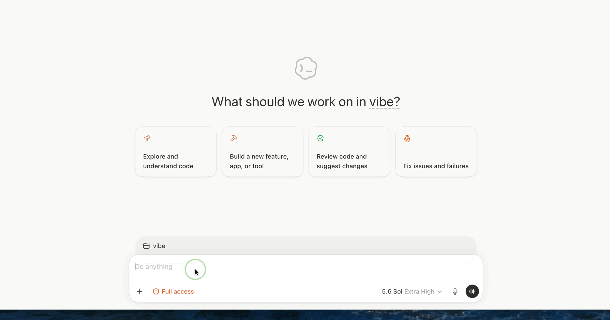

<div align="center">

# PromptHalo

**Five prompts. One gesture. Stay in flow.**

The shortest, least disruptive path I could make from “I need that prompt” to the full prompt in the active field.

[中文](#中文) · [Download Alpha](https://github.com/LLLc1018com-arch/PromptHalo/releases/tag/v0.3.0-alpha) · [Report a Bug](https://github.com/LLLc1018com-arch/PromptHalo/issues/new?template=bug_report.yml)


</div>

<p align="center">
  
</p>

<p align="center">
  <sub>Hold Left Option → choose a slot → release. PromptHalo inserts the prompt automatically.<br>The ⌘V badge is the app's emitted paste event, not an extra user action.</sub>
</p>

## Why I built this

Agent loops and reusable skills are powerful. But in my daily work, a carefully designed prompt is still one of the tools I reach for most.

I often find sharp, surprisingly useful prompts inside hard-core technical threads. I save them—and then rarely use them again. The problem is not discovery. The problem is the retrieval tax:

```text
Remember where it was
        ↓
Search the right note or collection
        ↓
Copy it
        ↓
Switch back
        ↓
Paste it
```

Each step looks trivial. Together, they spend the resource that matters most during deep coding work: attention.

PromptHalo reduces that path to one practiced motion:

```text
Hold → choose → release
```

No searching. No window switching. No manual copy and paste.

## Prompts should feel like equipment

The behavioral inspiration came from PUBG and the game feel of FPS controls.

In an intense fight, a weapon switch is good only when it protects your attention. You should not have to stop, open a library, read a list, and reconsider the interface. The control has to become natural enough to disappear into muscle memory.

Deep coding has the same constraint. Attention is scarce. A tiny context switch can break the chain of thought you were trying to protect.

A prompt you trust should therefore feel less like a document you fetch and more like a piece of equipment in a known slot. PromptHalo makes prompt retrieval spatial, repeatable, and fast enough to stay inside the work.

Speed is not a side benefit. Protecting attention is the point.

<sub>PromptHalo is an independent project and is not affiliated with PUBG or KRAFTON.</sub>

## Why exactly five?

Five is not a temporary beta limitation. It is the design constraint.

- The content of every slot is editable.
- The number of quick slots stays fixed at five.
- Five is enough for the prompts that genuinely deserve daily use.
- Five is still small enough to learn by position and call without searching.

If the wheel grows to 10, 20, or 50 slots, it becomes another prompt library. The user has to stop and search again. That defeats the reason PromptHalo exists.

The library can grow. The wheel stays five.

PromptHalo is not trying to help you collect every good prompt. It is trying to make the few you trust feel like part of your working memory.

## How it works

```text
Hold Left Option
        ↓
Choose 1–5 or move the pointer
        ↓
Release
        ↓
The full prompt is inserted into the active text field
```

<p align="center">
  
  
</p>

## What works today

- Native SwiftUI manager and AppKit non-activating radial wheel
- Five fixed quick slots, selected by number or pointer direction
- Long-press Left `Option` by default
- Customizable trigger, including Right `Option` or a normal key combination
- Direct insertion into the active text field
- Clipboard snapshot and restoration after insertion
- Local JSON storage, search, duplicate, trash, import, and export
- Chinese and English UI
- Interface language follows macOS by default and can be changed manually
- Universal binary for Apple silicon and Intel Macs

PromptHalo is an early Build in Public alpha. The core interaction works, but cross-app reliability and distribution are still being hardened.

## Five starter prompts

New installations receive five substantial, general-purpose prompts in the language of the initial interface:

1. **95% Clarity Gate** — clarify the task one question at a time before producing.
2. **Evidence-First Research** — separate facts, inference, dissent, and action.
3. **Plan · Critique · Execute** — define done, challenge the plan, execute, and verify.
4. **Human Voice Editor** — remove generic AI prose without flattening the author.
5. **Learn It for Real** — use diagnosis, Feynman explanation, active recall, and transfer.

Changing the interface language never translates or overwrites existing prompts.

The starter prompts were rewritten for PromptHalo after reviewing recent high-engagement prompt workflows on X. The research notes and source links are in [PROMPT_RESEARCH.md](PROMPT_RESEARCH.md).

## Install the Alpha

1. Download the Alpha ZIP from [GitHub Releases](https://github.com/LLLc1018com-arch/PromptHalo/releases/tag/v0.3.0-alpha).
2. Unzip it and move `PromptHalo.app` to `/Applications`.
3. Because the current alpha is not yet Apple-notarized, macOS may require Control-clicking the app and choosing **Open**.
4. In **System Settings → Privacy & Security → Accessibility**, allow PromptHalo.
5. Focus any text field, hold Left `Option` for about 0.22 seconds, choose `1–5`, then release.

The release is intentionally marked **pre-release** until Developer ID signing and notarization are in place.

## Build from source

Requirements:

- macOS 14 or later
- Swift 6.1 or newer Command Line Tools
- No full Xcode installation required

```bash
git clone https://github.com/LLLc1018com-arch/PromptHalo.git
cd PromptHalo

./run_tests.sh
./setup_local_signing.sh
./build_app.sh

open dist/PromptHalo.app
```

`setup_local_signing.sh` creates a local code-signing identity in your login keychain. It is used only to keep macOS permissions stable across local rebuilds.

## Data and privacy

PromptHalo has no account, cloud sync, analytics, or network dependency. Prompts stay on the Mac at:

```text
~/Library/Application Support/PromptHalo/prompts.json
```

Accessibility permission is used to monitor the configured trigger and emit paste events. If permission is unavailable, PromptHalo falls back to copying the prompt.

## Current validation

- Lightweight core checks: `6/6`
- Universal build: `arm64 + x86_64`
- Left `Option` → slot `1` → direct TextEdit insertion: passed
- Existing prompt data preserved when switching UI language: passed

Run the same checks locally with:

```bash
./run_tests.sh
```

## Roadmap

- [ ] Harden first-run Accessibility permission recovery
- [ ] Prevent insertion if the target app changes
- [ ] Expand the cross-app reliability matrix
- [ ] Add prompt-data backup and recovery
- [ ] Developer ID signing and Apple notarization
- [x] Add an animated public demo
- [ ] Improve first-run onboarding

The stop rule is simple: reliability before cloud sync, accounts, marketplaces, or AI rewriting.

## Contributing

Bug reports, reproduction steps, and small focused pull requests are welcome. Please read [CONTRIBUTING.md](CONTRIBUTING.md) before opening a PR.

The source is public for early feedback, but a reuse license has not yet been selected. Until a license is added, normal copyright restrictions apply.

---

## 中文

PromptHalo 是一个只活在 Mac 菜单栏里的 Prompt 喊话轮盘。

它是我能做出的，从“我需要那条 Prompt”到“完整 Prompt 已经出现在当前输入框”之间，最短、最少打断注意力的一条路径。

### 我为什么做它

Agent Loop 和可复用 Skill 都很强。但在我的日常工作中，一条经过认真设计、有巧思的 Prompt，仍然是最常用、最直接有效的工具之一。

我经常在硬核的技术分享里刷到真正好用的 Prompt。看到时觉得很有启发，顺手收藏起来，后来却很少真正使用。

问题不是我们没有收藏，而是使用成本太高：

```text
想起收藏在哪里
      ↓
打开笔记或 Prompt 库
      ↓
搜索
      ↓
复制
      ↓
切回工作界面
      ↓
粘贴
```

每一步单独看都不麻烦，但它们消耗的是深度 Coding 时最宝贵的东西：注意力。

PromptHalo 把这条路径压缩成一个连续动作：

```text
长按 → 选择 → 松开
```

不用搜索，不用切窗口，也不用再手动复制粘贴。

### Prompt 应该像道具一样被调用

PromptHalo 的行为灵感来自 PUBG，以及 FPS 游戏里那种自然、直接的操作感。

在激烈战斗中，一个被玩家认为“对”的切枪方式，一定是最保护注意力的方式。玩家不应该为了换一件武器停下来、打开仓库、搜索列表，再重新理解界面。正确的操作应该练到不需要思考，最后变成肌肉记忆。

聚精会神的 Coding 也是同一个道理。注意力非常贵。一次看似很小的窗口切换，也可能打断刚刚建立起来的思路。

因此，一条真正信任、经常使用的 Prompt，不应该像一份临时去找的文档，而应该像放在固定位置的道具：需要时自然切出，用完继续战斗。

更快不是附带收益。保护注意力才是这个产品存在的理由。

<sub>PromptHalo 是独立项目，与 PUBG 或 KRAFTON 没有关联。</sub>

### 为什么只有五个槽位

五个不是暂时的产品限制，而是刻意保留的设计约束。

- 每个槽位里的 Prompt 内容可以自由编辑。
- 快捷槽位的数量固定为五个。
- 五个足够容纳真正高频、值得反复使用的 Prompt。
- 五个又足够少，可以靠位置记忆，而不是重新搜索。

如果轮盘可以不断增加到 10 个、20 个甚至 50 个，它最终又会变成一个 Prompt 收藏夹。用户还是要停下来寻找，产品也就失去了“无损调用”和练成肌肉记忆的初衷。

后台的 Prompt 库可以继续增长，但前台轮盘永远只有五格。

PromptHalo 不负责帮你收藏所有好 Prompt。它只想让你真正练熟那几条自己认可的 Prompt。

### 核心操作

长按左 `Option`，按下 `1–5` 或移动鼠标，松手后完整 Prompt 直接进入当前输入框。

演示中的 `⌘V` 标识是 PromptHalo 自动发出的插入事件，不是用户需要多按的一步。

### 当前功能

- 五个固定快捷位，支持数字和方向选择
- 默认长按左 `Option`，也可自定义右 `Option` 或普通组合键
- 自动插入并恢复原剪贴板
- 本地 JSON 存储，不注册、不登录、不联网
- 搜索、新建、副本、最近删除、导入与导出
- 中文、英文界面，首次启动跟随 Mac 系统语言
- Apple 芯片和 Intel Mac 通用版本

### 使用

1. 从 [GitHub Releases](https://github.com/LLLc1018com-arch/PromptHalo/releases/tag/v0.3.0-alpha) 下载 Alpha ZIP。
2. 解压后把 `PromptHalo.app` 放进“应用程序”。
3. 当前版本尚未完成 Apple 公证，第一次打开可能需要右键应用并选择“打开”。
4. 在“系统设置 → 隐私与安全性 → 辅助功能”中允许 PromptHalo。
5. 在任意输入框长按左 `Option`，选择 `1–5`，松开后自动插入。

这是一个 Build in Public 的 Alpha。先把真正高频的 Prompt 变成肌肉记忆，再考虑更大的功能。
